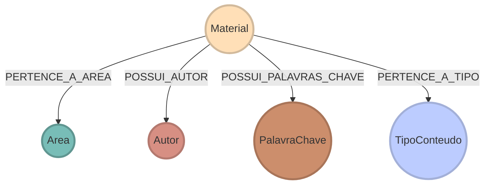

# edukb (Educational Knowledge Base)

## Modelagem do Banco de Dados de Grafos

### Schema do Banco

```mermaid 
graph 
    A((Material)) -->|PERTENCE_A_AREA| B((Area))
    A  --> |POSSUI_AUTOR| C((Autor))
    A  --> |POSSUI_PALAVRAS_CHAVE| D((PalavraChave))
    A  --> |PERTENCE_A_TIPO| E((TipoConteudo))
    style A fill:#ffdfb7,stroke:#d2ba9c,stroke-width:3px
    style B fill:#78bdb7,stroke:#609691,stroke-width:3px
    style C fill:#d78f83,stroke:#b4796f,stroke-width:3px
    style D fill:#cc8e6c,stroke:#a97559,stroke-width:3px
    style E fill:#bcccff,stroke:#a3b0d8,stroke-width:3px
```